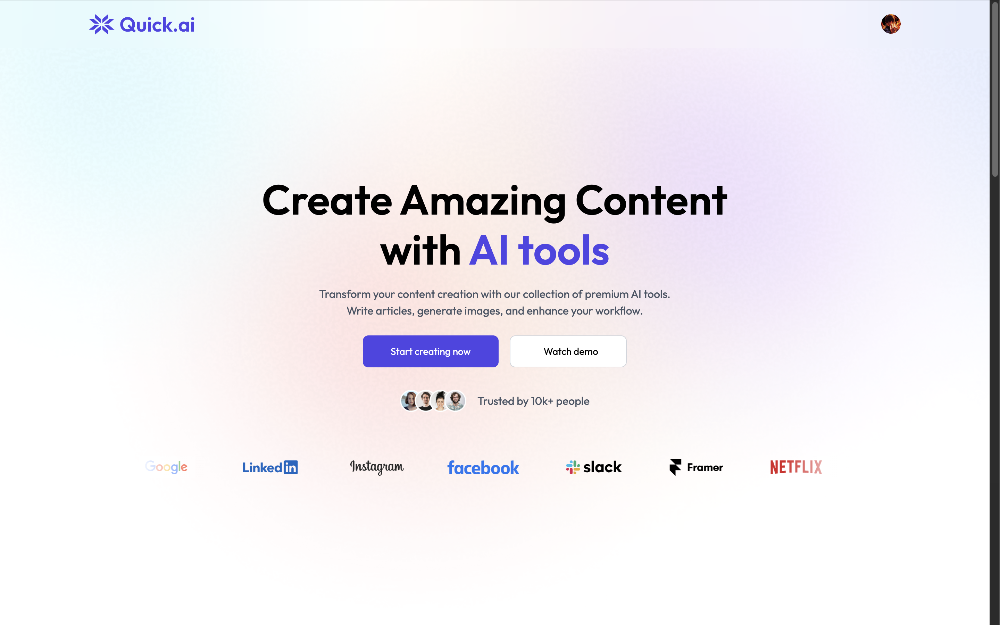
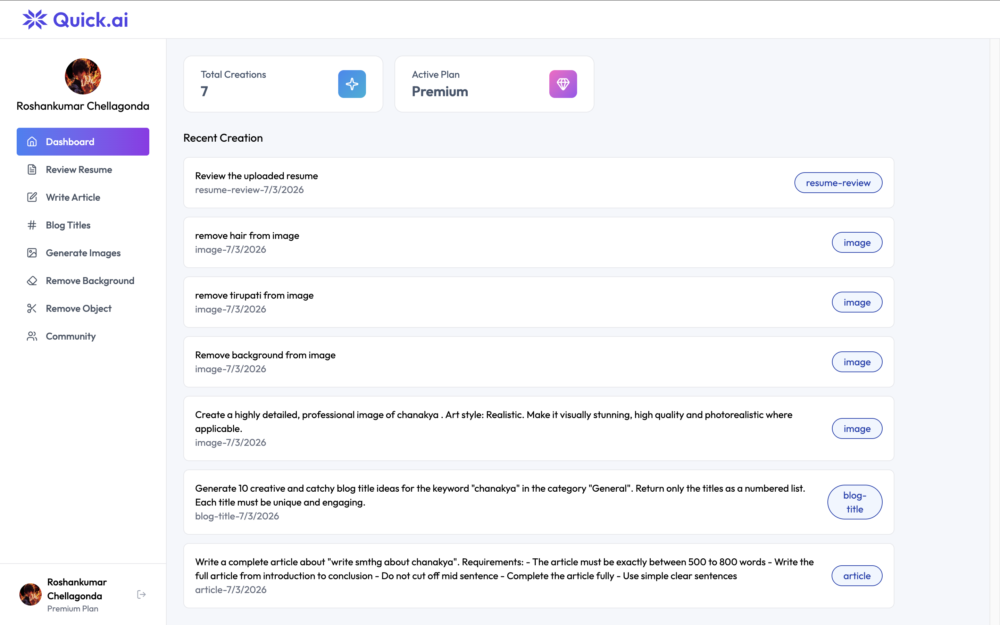

# Quick AI — Full Stack AI SaaS Application

A fully functional AI SaaS application built with the PERN stack 
featuring subscription billing and 6 AI-powered tools.

## 🚀 Live Link
[Quick AI](https:///)

## 🎬 Demo Video
[Watch here](https://drive.google.com/file/d/1b9ks3cvVoc_RcXoMTZR_rq5RePlqJDUi/view?usp=sharing/)

## 📸 Screenshots

### 🏠 Landing Page

### 📊 Dashboard

## ✨ AI Features
- 📄 Resume Analyzer — Upload resume and get detailed AI feedback
- 📝 Article Generator — Generate full articles by topic and length
- 🎨 Image Generator — Generate images by description and style
- 🖼️ Background Remover — Remove background from any image using AI
- 🧹 Object Remover — Remove any object from image using AI
- 📰 Blog Title Generator — Generate 10 catchy blog titles by keyword

## 🛠️ Tech Stack
- **Frontend** — React + Vite + Tailwind CSS v4
- **Backend** — Node.js + Express.js
- **Database** — PostgreSQL (Neon Serverless)
- **Auth & Billing** — Clerk (Authentication + Subscription Plans)
- **AI APIs** — Gemini AI + Clipdrop API
- **Storage** — Cloudinary
- **Deployment** — Vercel (Frontend) + Render (Backend)